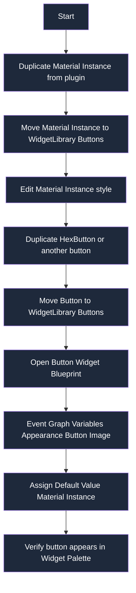

# Recommended Workflow

---

1. Duplicate a **Material Instance** from the plugin
- Move it into `WidgetLibrary/Buttons`

2. Adjust the material instance to your preferred style

3. Duplicate a **HexButton** from the plugin
- Move it into `WidgetLibrary/Buttons`

4. Update your duplicated button’s **Variable Defaults**:
- Open the widget in the Widget Blueprint Editor
- Click **Event Graph** (top-right)
- Locate the **Variables** panel on the left
- Expand the **Appearance** category
- Select the **Button Image** variable

If the Details panel does not appear:
- Top menu → **Window → Details**

In the **Details** panel for `Button Image`:
- Set **Default Value → Button Image**
- Assign your configured Material Instance from  
  `WidgetLibrary/Buttons`

5. Your newly themed button should now appear in the  
   **Aphril’s Widget Library** category in the Widget Palette

---

### Adding Your Button to the Common UI Category (Optional)

To place your button in the **Common UI** category (Common UI default for user-created widgets):

1. Open your button widget
2. Top menu → **File → Reparent Blueprint**
3. Select `CommonButtonBase`

---

### Creating Your Own Palette Category (Advanced)

1. Use the `UAwlMaterialButton` class as a baseline for a new C++ class
2. Use your own class name to avoid One Definition Rule (ODR) violations
3. Override `GetPaletteCategory()` to return your desired category name
4. Reparent the widgets you want in the new category to this new class.

---

## Additional Notes

This duplication-based workflow provides a strong default setup that includes:
- Built-in animations
- All AWL default behavior
- Instance-editable properties

This allows you to:
- Edit styling, button images, text styling, and text per widget
- Adjust defaults by editing variable default values in the Event Graph
- Customize buttons directly inside UMG Widget Blueprints (e.g., menus)

